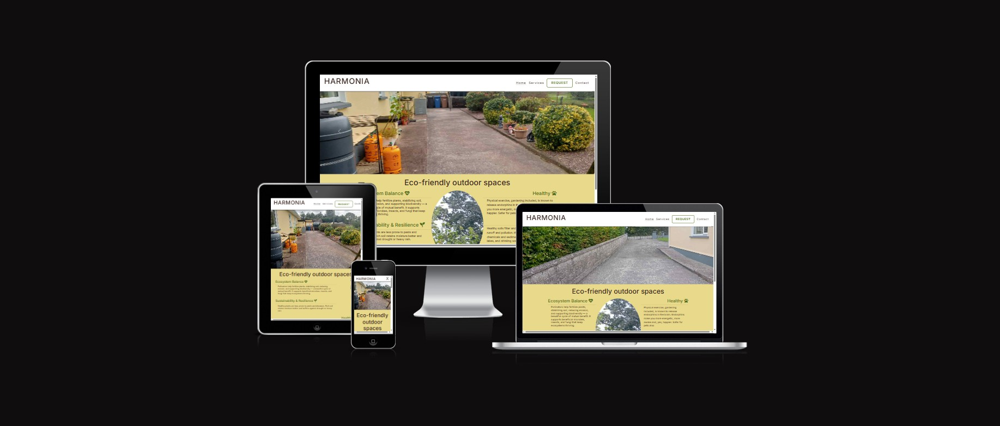
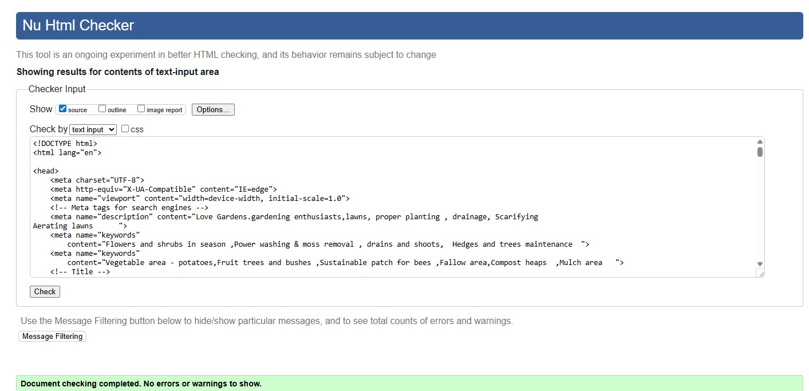
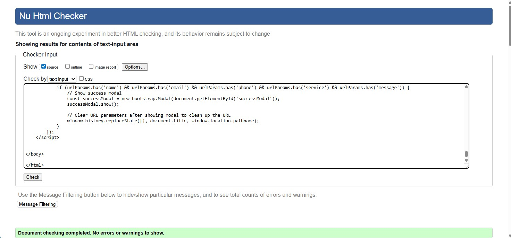

# Harmonia

Harmonia

## Introduction

"Harmonia" is my first assessed portfolio project, developed as part of the Code Institute Full Stack Software Developer Bootcamp. This project showcases my skills in HTML5, CSS3, and Bootstrap to create a responsive, accessible website promoting chemical free gardening and services available locally. The name Harmonia is actually co-pilot inspired.

The live project can be found here: <a href="https://pio-o-connell.github.io/Individual/">Harmonia</a>

<h2 align="center" id="TOC">Table of Contents</h2>

- [Harmonia](#harmonia)
  - [Introduction](#introduction)
  - [Project Outline](#project-outline)
    - [External User’s Goal:](#external-users-goal)
    - [Site Owner’s Goal:](#site-owners-goal)
    - [Key Objectives](#key-objectives)
  - [Project Planning](#project-planning)
    - [UX Design](#ux-design)
    - [User Stories](#user-stories)
  - [Colors](#colors)
  - [Fonts](#fonts)
    - [Wireframes](#wireframes)
  - [Imagery](#imagery)
  - [Features](#features)
    - [General Features](#general-features)
      - [Navigation and Carousel Section](#navigation-and-carousel-section)
      - [Bootstrap Cards](#bootstrap-cards)
      - [Footer](#footer)
      - [Links and Buttons](#links-and-buttons)
      - [Future development](#future-development)
    - [Responsive Design](#responsive-design)
  - [Built With](#built-with)
    - [Technologies and Languages](#technologies-and-languages)
    - [Libraries and Frameworks](#libraries-and-frameworks)
    - [Tools and Programs](#tools-and-programs)
  - [Deployment](#deployment)
  - [Testing](#testing)
    - [Validation](#validation)
      - [CSS](#css)
      - [HTML](#html)
    - [Lighthouse](#lighthouse)
    - [Media](#media)

<a href="#harmonia">Back To Top</a>

## Project Outline

### External User’s Goal:

The user seeks accessible, beginner-friendly information on the benefits of eco-friendly gardening practices and behaviours.

### Site Owner’s Goal:

The site owner wants to create a welcoming webpage that provides infomation on eco-friendly gardening using a clean and supportive design. The focus is on using HTML and CSS with Bootstrap to create a calming and well-organised user experience.

### Key Objectives

- Design and implement an interactive front-end web application using HTML and CSS based on user experience design principles, accessibility, and responsiveness.
- Test and validate the web application through the development, implementation, and deployment stages.
- Deploy the one-page web application to a cloud platform.
- Maximise future maintainability through documentation, code structure, and organisation.
- Leverage AI tools to orchestrate the software development process.

## Project Planning

### UX Design

### User Stories

- I am the site owner who wants to highlight the need for everybody to create a more sustainable environment
- I want the home page especially to have a welcoming carousel section with positive images of a thriving garden so that users feel encouraged to learn more about ecofriendly centric garden behaviours and practies.
- I want to draw attention to common garden jobs and their frequency to achieve the goal of a healthy maintainable garden.
- I also want to offer services that are available in THEIR local area.
- I am a user interested in learning about gardening . I want clear, concise information presented in a structured way so that I can understand the basics.
- I am a user seeking professional advice
- I am a user that maintains my own garden although I do need help from time to time
- I am a user that feel its unnessary to buy all the equipment, easier to hire gardener once a year for a particulat job
- I am user that would like to work at gardening
- I am a site owner aiming for a responsive design. I want the page to adjust seamlessly on any screen size so that users on different devices can access the content without issues.
- I am a visitor seeking professional gardening information. I want a simple layout so that I can easily find the information without feeling overwhelmed.
- I am a user interested in seeing results and I want to feel encouraged and motivated to take affirmative action while browsing the site.
- I am a person who may need additional resources for gardening support. I want a list of reputable links to gardening organizations so that I can access further information and support if needed.
- As a teacher seeking to support my students, I want educational materials or activities that I can use in my classroom so that I can promote gardening among students.
- As a user interested in mental health events, I want a calendar or list of upcoming webinars and workshops so that I can participate in live learning opportunities.

<a href="#harmonia">Back To Top</a>

## Colors

There are a lot of colours in a garden already so I used , one PRIMARY colour for all text SECONDARY and the use of whitespace where appropiate.

I used image picker website to choose a colour scheme https://imagecolorpicker.com/
The image is

The colour swatch using < https://coolors.co/e9d98a-506d1b-c9b66b-e6e2d2-4d4d4d > -
.

|-----Main Palette---------|---Hex---------|------------------------------------------| 
|---------------------------|---------------|---------------------------------------------| 
|--------------------------|---------------|---------------------------------------------| 
|-**Flax**-----------------|-#E9D98A-------|--A simple background – `background:---------| 
|--------------------------|---------------|---------------------------------------------| 
|- **Dark Moss Green**-----|-#506D1B-------|--Secondary colour---------------------------| 
|--------------------------|---------------|---------------------------------------------| 
|--------------------------|---------------|--CTA:- Secondary button--| --------------| 
|--------------------------|---------------|---------------------------------------------| 
|----**Ecru**--------------|-#C9B66B-------|--highlight  links or hover effects----------| 
|--------------------------|---------------|---------------------------------------------| 
|----**Eggshell**----------|-#E6E2D2-------|--Perfect for background areas or cards.-----| 
|--------------------------|---------------|---------------------------------------------| 
|----**Davy’s Grey**-------|-#4D4D4D-------|--Primary colour-----------------------------| 
|--------------------------|---------------|---------------------------------------------| 
|--------------------------|---------------|--Title and subtitles------------------------| 
|--------------------------|---------------|---------------------------------------------| 
|--------------------------|---------------|--Body text----------------------------------| 
|--------------------------|---------------|---------------------------------------------| 
|--------------------------|---------------|--Links:-------------------------------------| 
|--------------------------|---------------|---------------------------------------------| 

To guarantee adherence to accessibility standards, the [Colour Contrast Checker](https://colourcontrast.cc/) (also available as a Chrome extension), [WebAIM](https://webaim.org/resources/contrastchecker/) Contrast Checker, and [Adobe Color](https://color.adobe.com/create/color-contrast-analyzer) tools were used to validate contrast levels. These tools helped to make informed decisions regarding the final design.

<a href="#harmonia">Back To Top</a>

## Fonts

Similar to colour, the font should be easy to read. Thus one font is only necessary ; titles, body, and quotes. These were implemnted through [Google Fonts](https://fonts.google.com) using a direct import code within the style.css file.

/_ Google fonts import _/
@import url('https://fonts.googleapis.com/css2?family=Inter:wght@100..900&family=Macondo&display=swap');

[Inter](https://fonts.google.com/specimen/Inter) was used everywhere.

<a href="#harmonia">Back To Top</a>

### Wireframes

**Mobile Wireframe**

**Tablet Wireframe**

**Desktop Wireframes**

<a href="#harmonia">Back To Top</a>

## Imagery

I wanted to convey a garden well maintained is a beautiful open space. Therfore I have a carousel effect on the main page features images from a garden that I do maintain. It is hoped that this is the main focus of attention. Evrything else is minimised fonts ,colours . There would be a lot more colour again in the summertime,

For the background images on cards I simply use youtube frampicker option. It needed to be actual real pictures.

<a href="#harmonia">Back To Top</a>

## Features

### General Features

#### Navigation and Carousel Section

I decided to use images of a garden I maintain to convey my message about beautiful open spaces. This section features a CTA button that then opens to maintenance services available.

The navigation bar is a Bootstrap component that allows for easy navigation around the site using a familiar method for a positive user experience.

#### Bootstrap Cards

Bootstrap cards were used for the services section, to layout quick actionable tips. Each card has a linkto extra resources and a book to callout.

#### Footer

For the footer I used bootstrap utilities so that it sticks to the bottom of the page. The footer includes contact information as well as links to social media platforms and the privacy agreement.

<a href="#harmonia">Back To Top</a>

#### Links and Buttons

Buttons were customised to their specific role and page layout. This is so that they stand out from their backgrounds and provide uniform function based on design. This was implemnted by customising the btn-primary and btn-secondary bootsrap classes.

#### Future development

With more time I would create the additional resources page and link it to the appropriate buttons. This page would go into more details about how to manage stress, with embeded videos to provide user interaction.

<a href="#harmonia">Back To Top</a>

### Responsive Design

This project was made responsive by utilising bootstrap's grid system as well as a couplemedia queeries.

This website is fully responsive, meaning it automatically adjusts to different screen sizes, whether viewed on a mobile phone, tablet, or desktop.

Click to view responsiveness

[Click to view live responsiveness](https://ui.dev/amiresponsive?url=https://pio-o-connell.github.io/Individual/index.html)  

 

Implementation Details

• The [Bootstrap framework](https://getbootstrap.com) allowed for a responsive design without the need for additional CSS or media queries.  
• In some instances, responsiveness required fine-tuning and troubleshooting, particularly with the assistance of GitHub Copilot, an AI-powered coding assistant designed to help developers write code more efficiently. It provides real-time code suggestions, automates repetitive tasks, and even helps debug and refactor code.  
• While some awkward elements still exist, the site successfully adapts to various screen sizes.
 

<a href="#harmonia">Back To Top</a>

## Built With

### Technologies and Languages

- HTML5
- CSS3
- GitHub

### Libraries and Frameworks

- Bootstrap 5.3.3
- Font Awesome
- Google Fonts

### Tools and Programs

- Balsamiq
- ChatGPT
- MS CoPilot
- GitHub CoPilot

<a href="#harmonia">Back To Top</a>

## Deployment

This [GitHub](https://github.com/) project was created using the [Code Institute Template](https://github.com/Code-Institute-Org/ci-full-template) ensuring all necessary dependencies.

Setup a repo using this method and template:

1. Login to your GitHub profile.
2. Navigate to the Code Institute Full Template
3. Click the dropdown for 'Use this template' and select "Create a new repository"
4. Generate the necessary name and description for your repo and click 'Create repository from template'
5. Navigate to the new repo and click the green 'Open' button with the Gitpod logo 
   **IMPORTANT - This button should only be clicked once to generate the new IDE workspace**
6. You can now work on your repository within the Code Institute Gitpod IDE workspace

Once the project repo is created, an early deployment for the live project should performed. 
This allows for early and continuous testing using a variety of devices, as well as the Dev Tools available within browsers.

Additional information on the deployment process can be found on the official [GitHub Docs](https://docs.github.com/en/pages/quickstart)

<a href="#harmonia">Back To Top</a>

## Testing

### Validation

#### CSS

0 errors found. warnings arisen using webkit : msflexbox,webkit,webkit-backshadow

#### HTML

0 errors found on home page.

0 errors on services page

0 errors on request

### Lighthouse

A Lighthouse audit was conducted using the tool on Chrome Devtools of each web page.

Home page: 92%

Services: 97%

Request: 99%

<a href="#harmonia">Back To Top</a>

### Media

All photos aquired from my personal collection.
Hero icarousel image personal and favicon made by Microsoft Copilot.
Hero Carousel were compressed using the https://squoosh.app/ Image compressor
Images for services were generated by Microsoft copliot

<a href="#harmonia">Back To Top</a>

